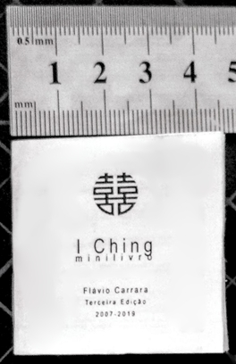

### miniic
##### Mini I-Ching Edition, Possibly Smallest On Earth
---
*miniic* generates a printable duplex page of I Ching, the book of changes.

The edition includes the raw I Ching, for only _The Judgement_, _The Image_ and the _Moving Lines_. Interpretations are left to the oracle consultant.

- Click on "port" or "eng" to alternate languages (portugues or english)

**Live Demo** *Don't worry* if it looks _huge_ on screen. It is only meant to be printed:
[https://fde-capu.github.io/miniic/](https://fde-capu.github.io/miniic/)

Printing:

- Print front and back one at the time.
- You need the front and back cut marks aligned; this is tricky and depends on the system and printer.
- Remeber to set the maximum available quality.

Assembling:

- Sharply cut the pages by the cut marks.
- Set the pagination sequence in order. Take note the sheets will fold on each other.

Binding with staples\*:
- Take a loose paper staple and mark two positions, four points of puncture.
- Take a needle and pierce the sheets at the proper spots.
- Manually tit two paper staples facing the middle page through the holes and user your fingernails to close them.
- Use a stiletto to chop off the exceding page alignments.
\* You may wish instead to manually sew the pages.

Extras:

- Make a case, for example, take a good quality plastic bag, a double-sized adehesive tape and a hot knife to make a small impermeable case.
- Keep miniic in your wallet.

---

Copyright (c) fde-capu

The software and .txt files editing are authoral and I reserve the rights of not letting you profit from it without my consent.

Since the text itself is one of the oldest in the human history (if not the oldest) and I have removed any third party interpretations, I believe the text is free to use. English version is adapted from the [classical translation by Cary F. Baynes](https://press.princeton.edu/books/hardcover/9780691097503/the-i-ching-or-book-of-changes). On the same manner, the Portuguese translation is from the same book [translated by Editora Pensamento](https://www.grupopensamento.com.br/produto/i-ching-o-livro-das-mutacoes-4866). I make no profit from these materials. The GitHub page is a portifolio showcase, I honestly believe it is fair use. If you think this violates any of your rights, please let me know as soon as possible, and I will torn this whole page down.

Cover: Artwork "double happiness" made by me, free to use, but I will be happy if you let me know.

Back-cover: art by Robin (from [here](https://adtudo.wordpress.com/2008/04/03/)) based on the Chinese Culture of the I Ching, permission requested.
